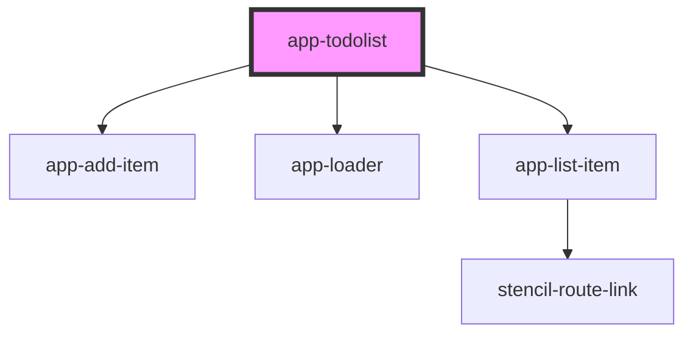

# app-todolist

<!-- Auto Generated Below -->

## Methods

### `myMethod() => Promise<number>`

#### Returns

Type: `Promise<number>`

### `myMethod2() => Promise<number>`

#### Returns

Type: `Promise<number>`

### `myMethod3() => Promise<void>`

#### Returns

Type: `Promise<void>`

## Dependencies

### Depends on

- [app-add-item](components\app-add-item)
- [app-loader](..\common\app-loader)
- [app-list-item](components\app-list-item)

### Graph

----------------------------------------------

*Built with [StencilJS](https://stenciljs.com/)*
